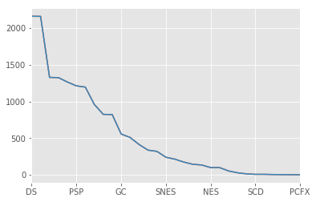
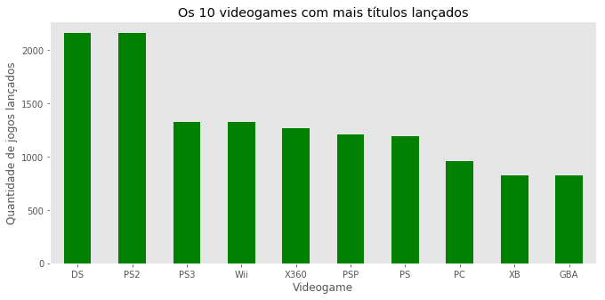
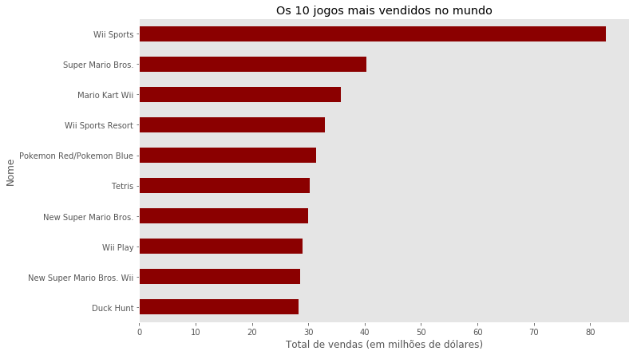
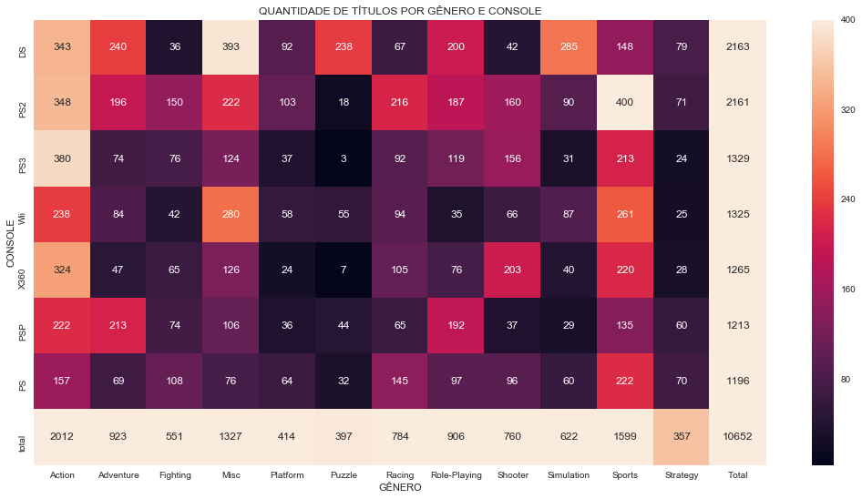

<h1>Venda de jogos de videogame na História</h1>
<br>
Esta apresentação foi criada por <b>Paulo Henrique Vasconcellos</b>. Aqui eu irei realizar algumas análises sobre os dados encontrados <a href='https://www.kaggle.com/gregorut/videogamesales'>neste dataset</a>.


```python
%matplotlib inline
import pandas as pd
import matplotlib.pyplot as plt
import seaborn as sns
plt.style.use('ggplot')
```


```python
#Leitura do arquivo
videogames = pd.read_csv('vgsales.csv')
```


```python
#Exibindo as 10 primeiras linhas do Dataframe
videogames.head(10)
```


<div>
<style>
    .dataframe thead tr:only-child th {
        text-align: right;
    }

    .dataframe thead th {
        text-align: left;
    }

    .dataframe tbody tr th {
        vertical-align: top;
    }
</style>
<table border="1" class="dataframe">
  <thead>
    <tr style="text-align: right;">
      <th></th>
      <th>Rank</th>
      <th>Name</th>
      <th>Platform</th>
      <th>Year</th>
      <th>Genre</th>
      <th>Publisher</th>
      <th>NA_Sales</th>
      <th>EU_Sales</th>
      <th>JP_Sales</th>
      <th>Other_Sales</th>
      <th>Global_Sales</th>
    </tr>
  </thead>
  <tbody>
    <tr>
      <th>0</th>
      <td>1</td>
      <td>Wii Sports</td>
      <td>Wii</td>
      <td>2006.0</td>
      <td>Sports</td>
      <td>Nintendo</td>
      <td>41.49</td>
      <td>29.02</td>
      <td>3.77</td>
      <td>8.46</td>
      <td>82.74</td>
    </tr>
    <tr>
      <th>1</th>
      <td>2</td>
      <td>Super Mario Bros.</td>
      <td>NES</td>
      <td>1985.0</td>
      <td>Platform</td>
      <td>Nintendo</td>
      <td>29.08</td>
      <td>3.58</td>
      <td>6.81</td>
      <td>0.77</td>
      <td>40.24</td>
    </tr>
    <tr>
      <th>2</th>
      <td>3</td>
      <td>Mario Kart Wii</td>
      <td>Wii</td>
      <td>2008.0</td>
      <td>Racing</td>
      <td>Nintendo</td>
      <td>15.85</td>
      <td>12.88</td>
      <td>3.79</td>
      <td>3.31</td>
      <td>35.82</td>
    </tr>
    <tr>
      <th>3</th>
      <td>4</td>
      <td>Wii Sports Resort</td>
      <td>Wii</td>
      <td>2009.0</td>
      <td>Sports</td>
      <td>Nintendo</td>
      <td>15.75</td>
      <td>11.01</td>
      <td>3.28</td>
      <td>2.96</td>
      <td>33.00</td>
    </tr>
    <tr>
      <th>4</th>
      <td>5</td>
      <td>Pokemon Red/Pokemon Blue</td>
      <td>GB</td>
      <td>1996.0</td>
      <td>Role-Playing</td>
      <td>Nintendo</td>
      <td>11.27</td>
      <td>8.89</td>
      <td>10.22</td>
      <td>1.00</td>
      <td>31.37</td>
    </tr>
    <tr>
      <th>5</th>
      <td>6</td>
      <td>Tetris</td>
      <td>GB</td>
      <td>1989.0</td>
      <td>Puzzle</td>
      <td>Nintendo</td>
      <td>23.20</td>
      <td>2.26</td>
      <td>4.22</td>
      <td>0.58</td>
      <td>30.26</td>
    </tr>
    <tr>
      <th>6</th>
      <td>7</td>
      <td>New Super Mario Bros.</td>
      <td>DS</td>
      <td>2006.0</td>
      <td>Platform</td>
      <td>Nintendo</td>
      <td>11.38</td>
      <td>9.23</td>
      <td>6.50</td>
      <td>2.90</td>
      <td>30.01</td>
    </tr>
    <tr>
      <th>7</th>
      <td>8</td>
      <td>Wii Play</td>
      <td>Wii</td>
      <td>2006.0</td>
      <td>Misc</td>
      <td>Nintendo</td>
      <td>14.03</td>
      <td>9.20</td>
      <td>2.93</td>
      <td>2.85</td>
      <td>29.02</td>
    </tr>
    <tr>
      <th>8</th>
      <td>9</td>
      <td>New Super Mario Bros. Wii</td>
      <td>Wii</td>
      <td>2009.0</td>
      <td>Platform</td>
      <td>Nintendo</td>
      <td>14.59</td>
      <td>7.06</td>
      <td>4.70</td>
      <td>2.26</td>
      <td>28.62</td>
    </tr>
    <tr>
      <th>9</th>
      <td>10</td>
      <td>Duck Hunt</td>
      <td>NES</td>
      <td>1984.0</td>
      <td>Shooter</td>
      <td>Nintendo</td>
      <td>26.93</td>
      <td>0.63</td>
      <td>0.28</td>
      <td>0.47</td>
      <td>28.31</td>
    </tr>
  </tbody>
</table>
</div>


```python
#Resumo de informações em todas as colunas
videogames.describe()
```


<div>
<style>
    .dataframe thead tr:only-child th {
        text-align: right;
    }

    .dataframe thead th {
        text-align: left;
    }

    .dataframe tbody tr th {
        vertical-align: top;
    }
</style>
<table border="1" class="dataframe">
  <thead>
    <tr style="text-align: right;">
      <th></th>
      <th>Rank</th>
      <th>Year</th>
      <th>NA_Sales</th>
      <th>EU_Sales</th>
      <th>JP_Sales</th>
      <th>Other_Sales</th>
      <th>Global_Sales</th>
    </tr>
  </thead>
  <tbody>
    <tr>
      <th>count</th>
      <td>16598.000000</td>
      <td>16327.000000</td>
      <td>16598.000000</td>
      <td>16598.000000</td>
      <td>16598.000000</td>
      <td>16598.000000</td>
      <td>16598.000000</td>
    </tr>
    <tr>
      <th>mean</th>
      <td>8300.605254</td>
      <td>2006.406443</td>
      <td>0.264667</td>
      <td>0.146652</td>
      <td>0.077782</td>
      <td>0.048063</td>
      <td>0.537441</td>
    </tr>
    <tr>
      <th>std</th>
      <td>4791.853933</td>
      <td>5.828981</td>
      <td>0.816683</td>
      <td>0.505351</td>
      <td>0.309291</td>
      <td>0.188588</td>
      <td>1.555028</td>
    </tr>
    <tr>
      <th>min</th>
      <td>1.000000</td>
      <td>1980.000000</td>
      <td>0.000000</td>
      <td>0.000000</td>
      <td>0.000000</td>
      <td>0.000000</td>
      <td>0.010000</td>
    </tr>
    <tr>
      <th>25%</th>
      <td>4151.250000</td>
      <td>2003.000000</td>
      <td>0.000000</td>
      <td>0.000000</td>
      <td>0.000000</td>
      <td>0.000000</td>
      <td>0.060000</td>
    </tr>
    <tr>
      <th>50%</th>
      <td>8300.500000</td>
      <td>2007.000000</td>
      <td>0.080000</td>
      <td>0.020000</td>
      <td>0.000000</td>
      <td>0.010000</td>
      <td>0.170000</td>
    </tr>
    <tr>
      <th>75%</th>
      <td>12449.750000</td>
      <td>2010.000000</td>
      <td>0.240000</td>
      <td>0.110000</td>
      <td>0.040000</td>
      <td>0.040000</td>
      <td>0.470000</td>
    </tr>
    <tr>
      <th>max</th>
      <td>16600.000000</td>
      <td>2020.000000</td>
      <td>41.490000</td>
      <td>29.020000</td>
      <td>10.220000</td>
      <td>10.570000</td>
      <td>82.740000</td>
    </tr>
  </tbody>
</table>
</div>


```python
#Tipo de dado em cada coluna
videogames.dtypes
```


    Rank              int64
    Name             object
    Platform         object
    Year            float64
    Genre            object
    Publisher        object
    NA_Sales        float64
    EU_Sales        float64
    JP_Sales        float64
    Other_Sales     float64
    Global_Sales    float64
    dtype: object


```python
#Quantidade de linhas e colunas no Dataframe
videogames.shape
```


    (16598, 11)


```python
#Renomeando colunas
videogames.columns = ['Ranking', 'Nome', 'Plataforma', 'Ano', 'Gênero',
                      'Editora','Vendas América do Norte','Vendas EUA',
                      'Vendas Japão', 'Outras vendas', 'Vendas Global']
```


```python
#Exibindo as 10 primeiras linhas do arquivo
videogames.head(10)
```


<div>
<style>
    .dataframe thead tr:only-child th {
        text-align: right;
    }

    .dataframe thead th {
        text-align: left;
    }

    .dataframe tbody tr th {
        vertical-align: top;
    }
</style>
<table border="1" class="dataframe">
  <thead>
    <tr style="text-align: right;">
      <th></th>
      <th>Ranking</th>
      <th>Nome</th>
      <th>Plataforma</th>
      <th>Ano</th>
      <th>Gênero</th>
      <th>Editora</th>
      <th>Vendas América do Norte</th>
      <th>Vendas EUA</th>
      <th>Vendas Japão</th>
      <th>Outras vendas</th>
      <th>Vendas Global</th>
    </tr>
  </thead>
  <tbody>
    <tr>
      <th>0</th>
      <td>1</td>
      <td>Wii Sports</td>
      <td>Wii</td>
      <td>2006.0</td>
      <td>Sports</td>
      <td>Nintendo</td>
      <td>41.49</td>
      <td>29.02</td>
      <td>3.77</td>
      <td>8.46</td>
      <td>82.74</td>
    </tr>
    <tr>
      <th>1</th>
      <td>2</td>
      <td>Super Mario Bros.</td>
      <td>NES</td>
      <td>1985.0</td>
      <td>Platform</td>
      <td>Nintendo</td>
      <td>29.08</td>
      <td>3.58</td>
      <td>6.81</td>
      <td>0.77</td>
      <td>40.24</td>
    </tr>
    <tr>
      <th>2</th>
      <td>3</td>
      <td>Mario Kart Wii</td>
      <td>Wii</td>
      <td>2008.0</td>
      <td>Racing</td>
      <td>Nintendo</td>
      <td>15.85</td>
      <td>12.88</td>
      <td>3.79</td>
      <td>3.31</td>
      <td>35.82</td>
    </tr>
    <tr>
      <th>3</th>
      <td>4</td>
      <td>Wii Sports Resort</td>
      <td>Wii</td>
      <td>2009.0</td>
      <td>Sports</td>
      <td>Nintendo</td>
      <td>15.75</td>
      <td>11.01</td>
      <td>3.28</td>
      <td>2.96</td>
      <td>33.00</td>
    </tr>
    <tr>
      <th>4</th>
      <td>5</td>
      <td>Pokemon Red/Pokemon Blue</td>
      <td>GB</td>
      <td>1996.0</td>
      <td>Role-Playing</td>
      <td>Nintendo</td>
      <td>11.27</td>
      <td>8.89</td>
      <td>10.22</td>
      <td>1.00</td>
      <td>31.37</td>
    </tr>
    <tr>
      <th>5</th>
      <td>6</td>
      <td>Tetris</td>
      <td>GB</td>
      <td>1989.0</td>
      <td>Puzzle</td>
      <td>Nintendo</td>
      <td>23.20</td>
      <td>2.26</td>
      <td>4.22</td>
      <td>0.58</td>
      <td>30.26</td>
    </tr>
    <tr>
      <th>6</th>
      <td>7</td>
      <td>New Super Mario Bros.</td>
      <td>DS</td>
      <td>2006.0</td>
      <td>Platform</td>
      <td>Nintendo</td>
      <td>11.38</td>
      <td>9.23</td>
      <td>6.50</td>
      <td>2.90</td>
      <td>30.01</td>
    </tr>
    <tr>
      <th>7</th>
      <td>8</td>
      <td>Wii Play</td>
      <td>Wii</td>
      <td>2006.0</td>
      <td>Misc</td>
      <td>Nintendo</td>
      <td>14.03</td>
      <td>9.20</td>
      <td>2.93</td>
      <td>2.85</td>
      <td>29.02</td>
    </tr>
    <tr>
      <th>8</th>
      <td>9</td>
      <td>New Super Mario Bros. Wii</td>
      <td>Wii</td>
      <td>2009.0</td>
      <td>Platform</td>
      <td>Nintendo</td>
      <td>14.59</td>
      <td>7.06</td>
      <td>4.70</td>
      <td>2.26</td>
      <td>28.62</td>
    </tr>
    <tr>
      <th>9</th>
      <td>10</td>
      <td>Duck Hunt</td>
      <td>NES</td>
      <td>1984.0</td>
      <td>Shooter</td>
      <td>Nintendo</td>
      <td>26.93</td>
      <td>0.63</td>
      <td>0.28</td>
      <td>0.47</td>
      <td>28.31</td>
    </tr>
  </tbody>
</table>
</div>


```python
#Verificando linhas onde não há ano de lançamento definido
videogames[videogames['Ano'].isnull()].head()
```


<div>
<style>
    .dataframe thead tr:only-child th {
        text-align: right;
    }

    .dataframe thead th {
        text-align: left;
    }

    .dataframe tbody tr th {
        vertical-align: top;
    }
</style>
<table border="1" class="dataframe">
  <thead>
    <tr style="text-align: right;">
      <th></th>
      <th>Ranking</th>
      <th>Nome</th>
      <th>Plataforma</th>
      <th>Ano</th>
      <th>Gênero</th>
      <th>Editora</th>
      <th>Vendas América do Norte</th>
      <th>Vendas EUA</th>
      <th>Vendas Japão</th>
      <th>Outras vendas</th>
      <th>Vendas Global</th>
    </tr>
  </thead>
  <tbody>
    <tr>
      <th>179</th>
      <td>180</td>
      <td>Madden NFL 2004</td>
      <td>PS2</td>
      <td>NaN</td>
      <td>Sports</td>
      <td>Electronic Arts</td>
      <td>4.26</td>
      <td>0.26</td>
      <td>0.01</td>
      <td>0.71</td>
      <td>5.23</td>
    </tr>
    <tr>
      <th>377</th>
      <td>378</td>
      <td>FIFA Soccer 2004</td>
      <td>PS2</td>
      <td>NaN</td>
      <td>Sports</td>
      <td>Electronic Arts</td>
      <td>0.59</td>
      <td>2.36</td>
      <td>0.04</td>
      <td>0.51</td>
      <td>3.49</td>
    </tr>
    <tr>
      <th>431</th>
      <td>432</td>
      <td>LEGO Batman: The Videogame</td>
      <td>Wii</td>
      <td>NaN</td>
      <td>Action</td>
      <td>Warner Bros. Interactive Entertainment</td>
      <td>1.86</td>
      <td>1.02</td>
      <td>0.00</td>
      <td>0.29</td>
      <td>3.17</td>
    </tr>
    <tr>
      <th>470</th>
      <td>471</td>
      <td>wwe Smackdown vs. Raw 2006</td>
      <td>PS2</td>
      <td>NaN</td>
      <td>Fighting</td>
      <td>NaN</td>
      <td>1.57</td>
      <td>1.02</td>
      <td>0.00</td>
      <td>0.41</td>
      <td>3.00</td>
    </tr>
    <tr>
      <th>607</th>
      <td>608</td>
      <td>Space Invaders</td>
      <td>2600</td>
      <td>NaN</td>
      <td>Shooter</td>
      <td>Atari</td>
      <td>2.36</td>
      <td>0.14</td>
      <td>0.00</td>
      <td>0.03</td>
      <td>2.53</td>
    </tr>
  </tbody>
</table>
</div>


```python
#Contagem de jogos lançados por plataforma
videogames['Plataforma'].value_counts()
```


    DS      2163
    PS2     2161
    PS3     1329
    Wii     1325
    X360    1265
    PSP     1213
    PS      1196
    PC       960
    XB       824
    GBA      822
    GC       556
    3DS      509
    PSV      413
    PS4      336
    N64      319
    SNES     239
    XOne     213
    SAT      173
    WiiU     143
    2600     133
    NES       98
    GB        98
    DC        52
    GEN       27
    NG        12
    SCD        6
    WS         6
    3DO        3
    TG16       2
    GG         1
    PCFX       1
    Name: Plataforma, dtype: int64


```python
#Os dois pedaços de código abaixo fazem a mesma coisa
videogames['Plataforma'].value_counts().plot()

titulos_lancados = videogames['Plataforma'].value_counts()
titulos_lancados.plot()
```


    <matplotlib.axes._subplots.AxesSubplot at 0xbd60ef0>





```python
#Criando um gráfico utilizando apenas uma linha de código
videogames['Plataforma'].value_counts().head(10).plot(kind='bar', figsize=(11,5), grid=False, rot=0, color='green')

#Enfeitando o gráfico. Abaixo, definimos um título
plt.title('Os 10 videogames com mais títulos lançados')
plt.xlabel('Videogame') #eixo x
plt.ylabel('Quantidade de jogos lançados') #eixo y
plt.show()
```





```python
#Os 10 jogos mais vendidos da história
top_10_vendidos = videogames[['Nome','Vendas Global']].head(10).set_index('Nome').sort_values('Vendas Global', ascending=True)
top_10_vendidos.plot(kind='barh',figsize=(11,7), grid=False, color='darkred', legend=False)

plt.title('Os 10 jogos mais vendidos no mundo')
plt.xlabel('Total de vendas (em milhões de dólares)')
plt.show()
```





```python
#Mapa de calor
crosstab_vg = pd.crosstab(videogames['Plataforma'], videogames['Gênero'])
crosstab_vg.head()
```


<div>
<style>
    .dataframe thead tr:only-child th {
        text-align: right;
    }

    .dataframe thead th {
        text-align: left;
    }

    .dataframe tbody tr th {
        vertical-align: top;
    }
</style>
<table border="1" class="dataframe">
  <thead>
    <tr style="text-align: right;">
      <th>Gênero</th>
      <th>Action</th>
      <th>Adventure</th>
      <th>Fighting</th>
      <th>Misc</th>
      <th>Platform</th>
      <th>Puzzle</th>
      <th>Racing</th>
      <th>Role-Playing</th>
      <th>Shooter</th>
      <th>Simulation</th>
      <th>Sports</th>
      <th>Strategy</th>
    </tr>
    <tr>
      <th>Plataforma</th>
      <th></th>
      <th></th>
      <th></th>
      <th></th>
      <th></th>
      <th></th>
      <th></th>
      <th></th>
      <th></th>
      <th></th>
      <th></th>
      <th></th>
    </tr>
  </thead>
  <tbody>
    <tr>
      <th>2600</th>
      <td>61</td>
      <td>2</td>
      <td>2</td>
      <td>5</td>
      <td>9</td>
      <td>11</td>
      <td>6</td>
      <td>0</td>
      <td>24</td>
      <td>1</td>
      <td>12</td>
      <td>0</td>
    </tr>
    <tr>
      <th>3DO</th>
      <td>0</td>
      <td>1</td>
      <td>0</td>
      <td>0</td>
      <td>0</td>
      <td>1</td>
      <td>0</td>
      <td>0</td>
      <td>0</td>
      <td>1</td>
      <td>0</td>
      <td>0</td>
    </tr>
    <tr>
      <th>3DS</th>
      <td>182</td>
      <td>37</td>
      <td>14</td>
      <td>53</td>
      <td>28</td>
      <td>20</td>
      <td>11</td>
      <td>86</td>
      <td>7</td>
      <td>30</td>
      <td>26</td>
      <td>15</td>
    </tr>
    <tr>
      <th>DC</th>
      <td>3</td>
      <td>11</td>
      <td>12</td>
      <td>0</td>
      <td>2</td>
      <td>0</td>
      <td>6</td>
      <td>4</td>
      <td>3</td>
      <td>1</td>
      <td>10</td>
      <td>0</td>
    </tr>
    <tr>
      <th>DS</th>
      <td>343</td>
      <td>240</td>
      <td>36</td>
      <td>393</td>
      <td>92</td>
      <td>238</td>
      <td>67</td>
      <td>200</td>
      <td>42</td>
      <td>285</td>
      <td>148</td>
      <td>79</td>
    </tr>
  </tbody>
</table>
</div>


```python
#Adicionar coluna total
crosstab_vg['Total'] = crosstab_vg.sum(axis=1)
crosstab_vg.head()
```


<div>
<style>
    .dataframe thead tr:only-child th {
        text-align: right;
    }

    .dataframe thead th {
        text-align: left;
    }

    .dataframe tbody tr th {
        vertical-align: top;
    }
</style>
<table border="1" class="dataframe">
  <thead>
    <tr style="text-align: right;">
      <th>Gênero</th>
      <th>Action</th>
      <th>Adventure</th>
      <th>Fighting</th>
      <th>Misc</th>
      <th>Platform</th>
      <th>Puzzle</th>
      <th>Racing</th>
      <th>Role-Playing</th>
      <th>Shooter</th>
      <th>Simulation</th>
      <th>Sports</th>
      <th>Strategy</th>
      <th>Total</th>
    </tr>
    <tr>
      <th>Plataforma</th>
      <th></th>
      <th></th>
      <th></th>
      <th></th>
      <th></th>
      <th></th>
      <th></th>
      <th></th>
      <th></th>
      <th></th>
      <th></th>
      <th></th>
      <th></th>
    </tr>
  </thead>
  <tbody>
    <tr>
      <th>2600</th>
      <td>61</td>
      <td>2</td>
      <td>2</td>
      <td>5</td>
      <td>9</td>
      <td>11</td>
      <td>6</td>
      <td>0</td>
      <td>24</td>
      <td>1</td>
      <td>12</td>
      <td>0</td>
      <td>133</td>
    </tr>
    <tr>
      <th>3DO</th>
      <td>0</td>
      <td>1</td>
      <td>0</td>
      <td>0</td>
      <td>0</td>
      <td>1</td>
      <td>0</td>
      <td>0</td>
      <td>0</td>
      <td>1</td>
      <td>0</td>
      <td>0</td>
      <td>3</td>
    </tr>
    <tr>
      <th>3DS</th>
      <td>182</td>
      <td>37</td>
      <td>14</td>
      <td>53</td>
      <td>28</td>
      <td>20</td>
      <td>11</td>
      <td>86</td>
      <td>7</td>
      <td>30</td>
      <td>26</td>
      <td>15</td>
      <td>509</td>
    </tr>
    <tr>
      <th>DC</th>
      <td>3</td>
      <td>11</td>
      <td>12</td>
      <td>0</td>
      <td>2</td>
      <td>0</td>
      <td>6</td>
      <td>4</td>
      <td>3</td>
      <td>1</td>
      <td>10</td>
      <td>0</td>
      <td>52</td>
    </tr>
    <tr>
      <th>DS</th>
      <td>343</td>
      <td>240</td>
      <td>36</td>
      <td>393</td>
      <td>92</td>
      <td>238</td>
      <td>67</td>
      <td>200</td>
      <td>42</td>
      <td>285</td>
      <td>148</td>
      <td>79</td>
      <td>2163</td>
    </tr>
  </tbody>
</table>
</div>


```python
top10_platforms = crosstab_vg[crosstab_vg['Total'] > 1000].sort_values('Total', ascending = False)
top10_final = top10_platforms.append(pd.DataFrame(top10_platforms.sum(), columns=['total']).T, ignore_index=False)

sns.set(font_scale=1)
plt.figure(figsize=(18, 9))
sns.heatmap(top10_final, annot=True, vmax=top10_final.loc[:'PS', :'Strategy'].values.max(), vmin=top10_final.loc[:, :'Strategy'].values.min(), fmt='d')
plt.xlabel('GÊNERO')
plt.ylabel('CONSOLE')
plt.title('QUANTIDADE DE TÍTULOS POR GÊNERO E CONSOLE')
plt.show()

```




